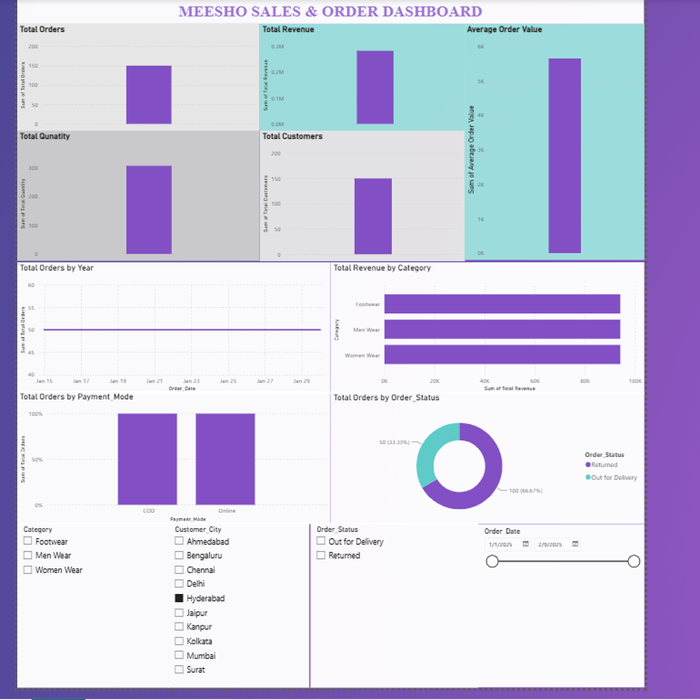

# 📊 Meesho Sales & Order Dashboard — Power BI

## 📌 Project Overview

This project presents an interactive **Sales & Order Dashboard** developed using **Microsoft Power BI** and a Meesho sales and order dataset.

The dashboard transforms raw sales data into meaningful visual insights, allowing users to analyze orders, revenue, customers, quantity, categories, payment modes, order status, cities, and dates through interactive filters.

## 🎯 Project Objective

The main objective of this project is to:

* Analyze overall sales and order performance
* Track important business KPIs
* Understand product category performance
* Analyze customer and order trends
* Compare different payment modes
* Monitor order status distribution
* Provide an interactive and easy-to-understand dashboard

## 🛠️ Tools & Technologies

* **Microsoft Power BI**
* **DAX**
* **Data Cleaning & Transformation**
* **Data Visualization**
* **Power Query**

## 📈 Key KPIs

The dashboard includes the following key metrics:

* 🛒 Total Orders
* 💰 Total Revenue
* 📦 Total Quantity
* 👥 Total Customers
* 📊 Average Order Value (AOV)

## 📊 Dashboard Features

### 🔹 Sales & Order Analysis

Provides an overview of overall orders, revenue, quantity, customers, and average order value.

### 🔹 Category Analysis

Analyzes sales performance across different product categories.

### 🔹 Payment Mode Analysis

Provides a comparison of orders based on payment methods such as Cash on Delivery and Online payments.

### 🔹 Order Status Analysis

Displays the distribution of different order statuses.

### 🔹 Interactive Filters

Users can interact with the dashboard using filters for:

* Category
* Customer City
* Order Status
* Order Date

These filters allow users to explore the data dynamically.

## 🖼️ Dashboard Preview



## 📂 Project Structure

```text
meesho-sales-order-dashboard-powerbi/
│
├── README.md
├── Meesho_Sales_Order_Dashboard.pbix
└── Meesho_Sales_Order_Dashboard_4K.png
```

## 💡 Key Learning Outcomes

Through this project, I gained practical experience in:

* Importing and preparing data in Power BI
* Creating DAX measures
* Designing interactive dashboards
* Creating and formatting KPI visuals
* Using slicers and filters
* Selecting appropriate visualizations
* Analyzing sales and order data
* Presenting business information through visual storytelling

## 🚀 Future Improvements

Possible future improvements include:

* Adding more advanced DAX calculations
* Creating additional time-based analysis
* Adding customer segmentation
* Developing more detailed product-level analysis
* Adding advanced drill-through pages

## 👨‍💻 Project Author

**Eddula Venkateswarlu**

B.Tech — Computer Science & Engineering

---

⭐ If you find this project useful, feel free to explore the repository and give it a star!
